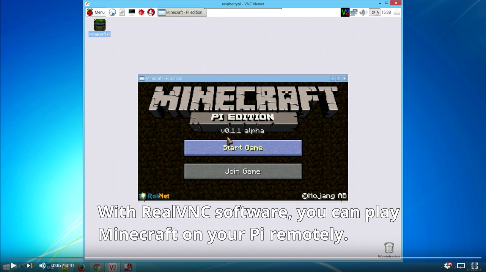
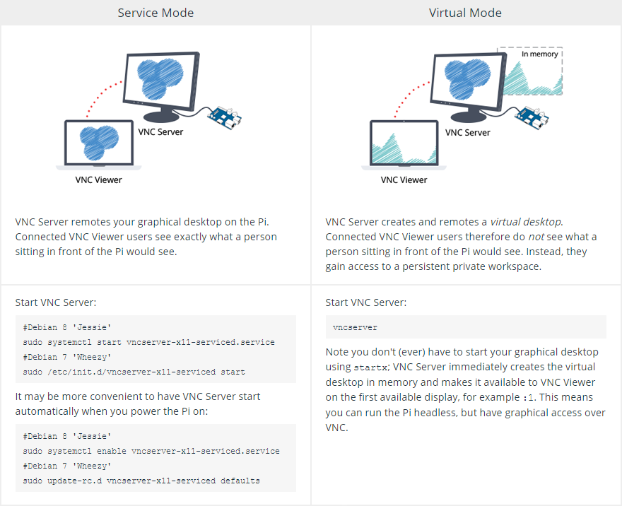
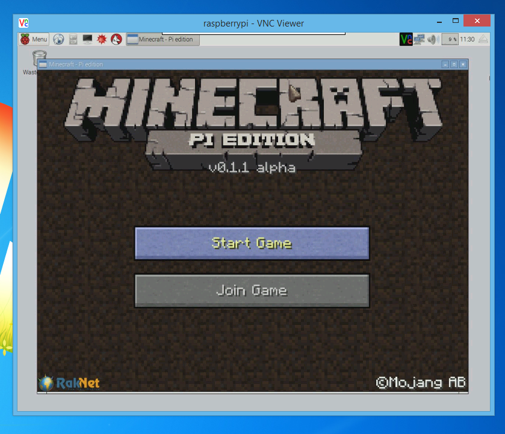
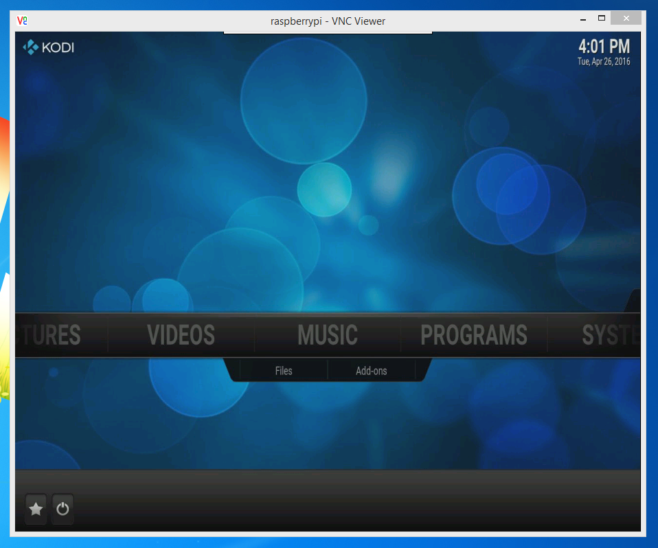

VNC for Raspberry Pi alpha
==========================

Thanks for your help testing the VNC for Raspberry Pi alpha! This build contains a whole host of improvements over our [stable release](https://www.realvnc.com/download/vnc/raspberrypi/), including Minecraft support, the ability to render the Pi's text console, and improved performance on all Pi models. 

See the full release notes [here](#releaseNotes). 

*Click the above image to see Minecraft over VNC in action.*

The alpha is automatically licensed with a [Personal license](https://www.realvnc.com/products/vnc/#versions) when you install it on your Raspberry Pi* (but feel free to apply an Enterprise license key of your own for additional features).  

As this is an alpha test, you may notice some bugs. A list of [known issues](#knownIssues) and instructions for [leaving feedback](#leavingFeedback) are included at the end of this Readme.

Don't forget you'll need [VNC Viewer](https://www.realvnc.com/download/viewer/) on the device you want to control your Pi from. 

**This license does not cover the use of VNC in a commercial environment.*

Release notes
=============

- **NEW:** Minecraft can now be played on the Raspberry Pi over VNC ([Service Mode](#startVnc) only).
- **NEW:** The Raspberry Pi's text console can now be accessed over VNC (Service Mode only). 
- **NEW:** Any program which uses a directly rendered overlay (e.g. Kodi, the Pi camera's preview window, omxplayer etc.) can now be used on the Pi over VNC (Service Mode only).  
- **NEW:** VNC Server now uses hardware acceleration on all Pi models, ensuring a faster, smoother experience.  

Prerequisites
=============

- Ensure your Pi is running Raspbian. 
- Ensure you are using your Pi's [recommended power supply](https://www.raspberrypi.org/help/faqs/#powerReqs). 
- For optimal performance, increase your Pi's GPU allocation to at least 128mb (this is 64mb by default). You can do this by running ``sudo raspi-config`` in Terminal and selecting **Advanced options > Memory Split**. 

Installation
============

Download the VNC Server binary through GitHub. Navigate to ``<download-directory>`` and run ``sudo dpkg -i VNC-Server-5.3.1-Linux-ARM.deb``. You can then [start VNC Server](#startVnc) at the command line. 

Starting VNC Server
===================

You can run VNC Server in two modes: Service Mode and Virtual Mode. You can even run both at the same time. 

Additional instructions, including how to connect a VNC Viewer device and how to stop VNC Server, are available [here](https://www.realvnc.com/products/vnc/raspberrypi/). 

Optimizing VNC Viewer for the Raspberry Pi
==========================================

To make the most of VNC Server's hardware acceleration, configure VNC Viewer in the following way: 

1. Run VNC Viewer and connect to the Raspberry Pi. 
2. On the VNC Viewer toolbar, click the **Options** button. 
3. Click **Advanced...**, then the **Expert** tab. 
4. Set ``PreferredEncoding`` to ``JPEG``, ``AutoSelect`` to ``False``, and ``ColorLevel`` to ``Full``. 

Playing Minecraft
=================

To play Minecraft over VNC: 

1. Run VNC Server in Service Mode on your Pi and connect to it with VNC Viewer. 
2. On your VNC Viewer device, press the F8 key and ensure **Relative Pointer Motion** is checked. 
3. Start and play Minecraft, as if you were sitting in front of the Pi. 
5. When you finish playing, press F8 and uncheck **Relative Pointer Motion**. 

Running Kodi
============

To use Kodi over VNC: 

1. Run VNC Server in Service mode on the Pi and connect to it with VNC Viewer. 
2. On your VNC Viewer device, press the F8 key and ensure **Relative Pointer Motion** is checked. 
2. Press Ctrl Alt F2 to access the Pi's console. 
3. Run ``kodi``. 
4. Use Kodi, as if you were sitting in front of the Pi. 
5. When you finish using Kodi, exit in the usual way. Then press F8 and uncheck **Relative Pointer Motion**. 

Known issues
============

- Kodi only accepts keyboard input over VNC when it is started by running ``kodi`` at the Raspberry Pi's console. 
- Connecting to a headless Pi may result in VNC Viewer's **Options** dialog being cut off. [Increase the Pi's default resolution](https://support.realvnc.com/knowledgebase/article/View/523) to fix. 

For an up-to-date list of known issues, please click [here](https://github.com/RealVNC/raspi-preview/issues). 

Leaving feedback
================

We'd love to hear your thoughts! If you have any feedback, or if you've spotted a bug, please let us know through GitHub's [issue reports](https://github.com/RealVNC/raspi-preview/issues) page. You can also tweet us [@RealVNC](https://twitter.com/RealVNC) or email us at [raspi@realvnc.com](mailto:raspi@realvnc.com).

Thanks for your help. 
